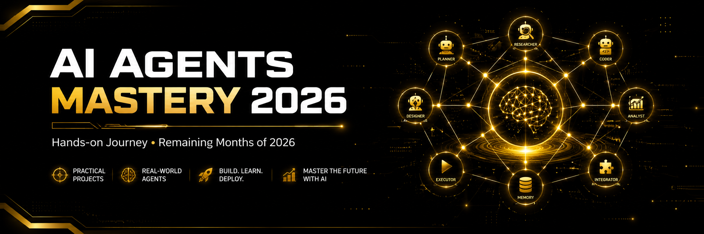

# 🤖 AI Agents Roadmap 2026: Learn & Build Real Agents Before the Year Ends

<div align="center">

### 🚀 Build Real Agents Before the Year Ends — one month at a time.

<!-- Banner Suggestion: A wide 1200x400 hero image with a dark navy/purple gradient background,
     a glowing neural-network / agent-orchestration graphic on the right, and bold text on the left:
     "AI AGENTS MASTERY · 2026 JOURNEY". Tools like Canva, Figma, or a quick Midjourney/DALL·E
     prompt ("futuristic AI agent network, dark theme, neon accents, minimal, banner") work great.
     Save it as assets/banner.png and reference it below: -->
<!--  -->

[](#-monthly-roadmap-2026)
[](https://github.com/Dani-8/ai-agents-2026/stargazers)
[](https://github.com/Dani-8/ai-agents-2026/network/members)
[](https://github.com/Dani-8/ai-agents-2026/commits/main)
[](./LICENSE)

**⭐ Star this repo to follow along — new agents ship monthly.**

</div>

---

## 📖 About This Repo

Welcome to a public roadmap + build-log for mastering **AI Agents** in 2026 — **build real agents before the year ends.**

This isn't a tutorial dump — it's a **living journal**. Every month I pick a theme, build a real agent around it, document what worked (and what spectacularly didn't), and push the code here. By December 31st, 2026, this repo should be a full portfolio of working agents spanning reasoning, tool use, memory, multi-agent orchestration, and production deployment.

> 💡 **Why public?** Accountability. If I ship nothing, you'll see nothing. That's the deal.

**Goals for 2026:**
- 🧠 Deeply understand agent architectures (ReAct, planning, reflection, multi-agent)
- 🛠️ Build 6+ production-grade agent projects
- 📚 Document lessons learned, mistakes, and benchmarks along the way
- 🌍 Contribute back — templates, notes, and reusable agent components for the community

---

## 📑 Table of Contents

- [About This Repo](#-about-this-repo)
- [Monthly Roadmap (2026)](#-monthly-roadmap-2026)
- [Progress Tracker](#-progress-tracker)
- [What I'll Build](#-what-ill-build)
- [Folder Structure](#-folder-structure)
- [Tech Stack](#-tech-stack)
- [How to Use This Repo](#-how-to-use-this-repo)
- [Resources I'm Learning From](#-resources-im-learning-from)
- [Journey Log](#-journey-log)
- [Follow Along](#-follow-along--support-the-journey)
- [License](#-license)

---

## 🗓️ Monthly Roadmap (2026)

| Month | Theme | Focus | Status |
|-------|-------|-------|--------|
| Jan – Jun | 🏗️ Foundations | LLM basics, prompting, RAG, tool calling, first agents | ✅ Complete |
| **Aug** | 🧭 **Planning & Reasoning Agents** | ReAct, Chain-of-Thought agents, task decomposition | 🔄 In Progress |
| **Sep** | 🧑‍🤝‍🧑 **Multi-Agent Systems** | Agent-to-agent communication, orchestration frameworks | 🔜 Upcoming |
| **Oct** | 🧠 **Memory & Long-Term Context** | Vector memory, episodic recall, self-improving agents | 🔜 Upcoming |
| **Nov** | 🔐 **Production-Ready Agents** | Guardrails, evaluation, observability, cost control | 🔜 Upcoming |
| **Dec** | 🚀 **Capstone & Deployment** | End-to-end autonomous agent, deployed live + full retrospective | 🔜 Upcoming |

> 📌 *Roadmap is a living document — themes may shift as tools and best practices evolve throughout the year.*

---

## 📊 Progress Tracker

```
Jan ████████████ 100%  Foundations
Feb ████████████ 100%  Foundations
Mar ████████████ 100%  Foundations
Apr ████████████ 100%  Foundations
May ████████████ 100%  Foundations
Jun ████████████ 100%  Foundations
Jul ██████░░░░░░  50%  Foundations Wrap-up
Aug ░░░░░░░░░░░░   0%  Planning & Reasoning Agents  🔄
Sep ░░░░░░░░░░░░   0%  Multi-Agent Systems
Oct ░░░░░░░░░░░░   0%  Memory & Long-Term Context
Nov ░░░░░░░░░░░░   0%  Production-Ready Agents
Dec ░░░░░░░░░░░░   0%  Capstone & Deployment
```

*(Updated manually at the start of each month — check the commit history for the latest.)*

---

## 🛠️ What I'll Build

| # | Project | Description | Month |
|---|---------|-------------|-------|
| 01 | 🔎 **ResearchBot** | Autonomous research agent that plans, searches, and synthesizes reports | Aug |
| 02 | 🕸️ **Swarm** | Multi-agent crew that collaborates to solve coding tasks | Sep |
| 03 | 🧵 **MemoryMind** | Agent with persistent long-term memory across sessions | Oct |
| 04 | 🛡️ **GuardedAgent** | Production agent with evaluation harness + safety guardrails | Nov |
| 05 | 🌐 **AutoOps** | Fully deployed autonomous agent handling a real-world workflow | Dec |
| 06 | 🎓 **Capstone: The 2026 Agent** | Combines everything learned into one flagship project | Dec |

Each project ships with its own `README.md`, architecture diagram, and a short write-up on lessons learned.

---

## 📂 Folder Structure

```
ai-agents-2026/
│
├── 📁 01-foundations/          # Jan–Jul: LLM basics, prompting, RAG, tool calling
├── 📁 02-planning-agents/      # Aug: ReAct, reasoning, task decomposition
├── 📁 03-multi-agent-systems/  # Sep: Orchestration, agent communication
├── 📁 04-memory-agents/        # Oct: Long-term memory, vector recall
├── 📁 05-production-agents/    # Nov: Guardrails, evals, observability
├── 📁 06-capstone/             # Dec: Final deployed agent + retrospective
│
├── 📁 assets/                  # Banners, diagrams, screenshots
├── 📁 notes/                   # Monthly learning logs & cheat sheets
├── 📁 templates/                # Reusable agent boilerplates & prompts
│
├── 📄 ROADMAP.md               # Full detailed roadmap
├── 📄 CHANGELOG.md             # Monthly changelog of progress
├── 📄 LICENSE
└── 📄 README.md                # You are here 👋
```

---

## ⚙️ Tech Stack

<div align="center">


</div>

**Core tools I'm using this year:**
- 🐍 **Python** — primary language for all agents
- 🔗 **LangChain / LangGraph** — agent orchestration & graph-based workflows
- 🧩 **Model Context Protocol (MCP)** — standardized tool/agent integration
- 🗄️ **Vector DBs** (Pinecone / Chroma / Weaviate) — memory & retrieval
- 🚦 **FastAPI** — serving agents as APIs
- 📦 **Docker** — reproducible environments & deployment
- 📈 **LangSmith / Arize** — tracing, evaluation, observability

---

## 🧭 How to Use This Repo

This isn't a plug-and-play package — it's a live learning trail. Here's how to get the most out of it:

- 📅 **Browse by month** — each folder (`02-planning-agents`, `03-multi-agent-systems`, etc.) covers one theme from the roadmap
- 📓 **Read the notes first** — [`notes/`](./notes) has plain-language write-ups before you touch any code
- 🧩 **Grab the templates** — [`templates/`](./templates) has reusable agent boilerplates you can drop into your own projects
- 🔍 **Check each project's own README** — every build under a monthly folder has its own setup + run instructions once it ships
- 🔁 **Come back monthly** — new folder, new agent, new lessons — that's the whole point

> New here? Start with [`01-foundations/`](./01-foundations) even if you're experienced — it sets the vocabulary used everywhere else.

---

## 📚 Resources I'm Learning From

A running list of what's actually shaping this journey — updated as I go:

- 📘 Courses & docs: *(add as you use them — e.g. DeepLearning.AI Agents courses, LangChain/LangGraph docs, Anthropic's agent building guides)*
- 📄 Papers: *(e.g. ReAct, Reflexion, Toolformer — add links as you read them)*
- 🎥 Talks & videos: *(add standout YouTube/conference talks here)*
- 🧑‍💻 People to follow: *(researchers/builders whose work influenced a month's approach)*

> 💡 Every resource here earned its place — no filler lists, just what actually helped.

---

## 📝 Journey Log

A running log of monthly reflections lives in [`notes/`](./notes) — real thoughts on what worked, what broke, and what I'd do differently. A few highlights:

- **Jul 2026** — Wrapped up foundations. RAG pipelines finally click. Moving to reasoning agents next.
- **Aug 2026** — *(in progress)* ReAct agents are deceptively simple to prototype, brutal to make reliable.

More monthly entries added as the year progresses. Follow the [commit history](https://github.com/Dani-8/ai-agents-2026/commits/main) for the raw, unfiltered version.

---

## 🌟 Follow Along & Support the Journey

If you're learning AI agents too, or just curious how this unfolds:

- ⭐ **Star this repo** — it's the easiest way to stay updated and helps others discover it
- 👀 **Watch** for monthly release notifications
- 🍴 **Fork it** and build your own 2026 journey alongside mine
- 💬 Open an **issue** or **discussion** if you spot something to improve or want to collaborate
- 🔁 Share it if it's useful — more builders learning in public makes the whole field better

<div align="center">

### 🔥 5 months left. 6 projects. 1 goal: real AI Agent mastery.

**Let's build it in public.**

[](https://star-history.com/#Dani-8/ai-agents-2026&Date)

</div>

---

## 📄 License

This project is licensed under the [MIT License](./LICENSE) — feel free to use the templates and structure for your own learning journey.

<div align="center">

Made with ☕, 🧠, and a lot of debugging by **[Dani-8](https://github.com/Dani-8)**

</div>
